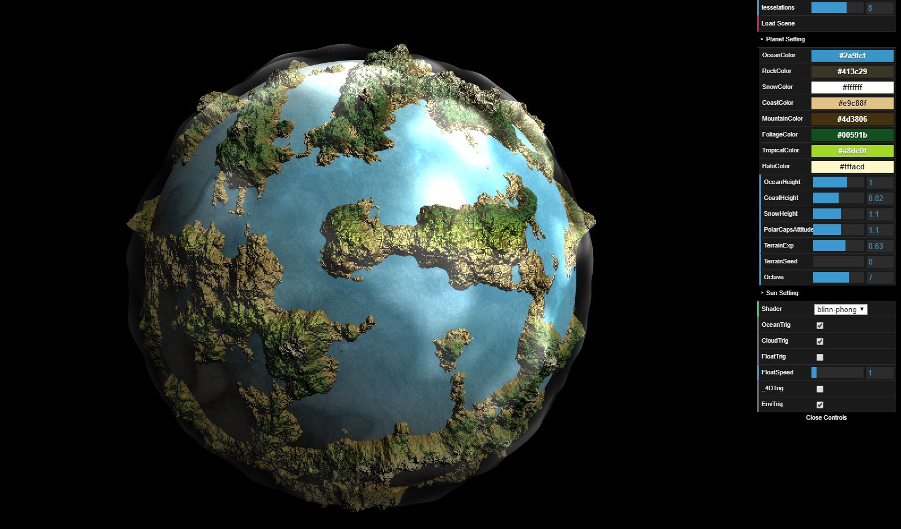
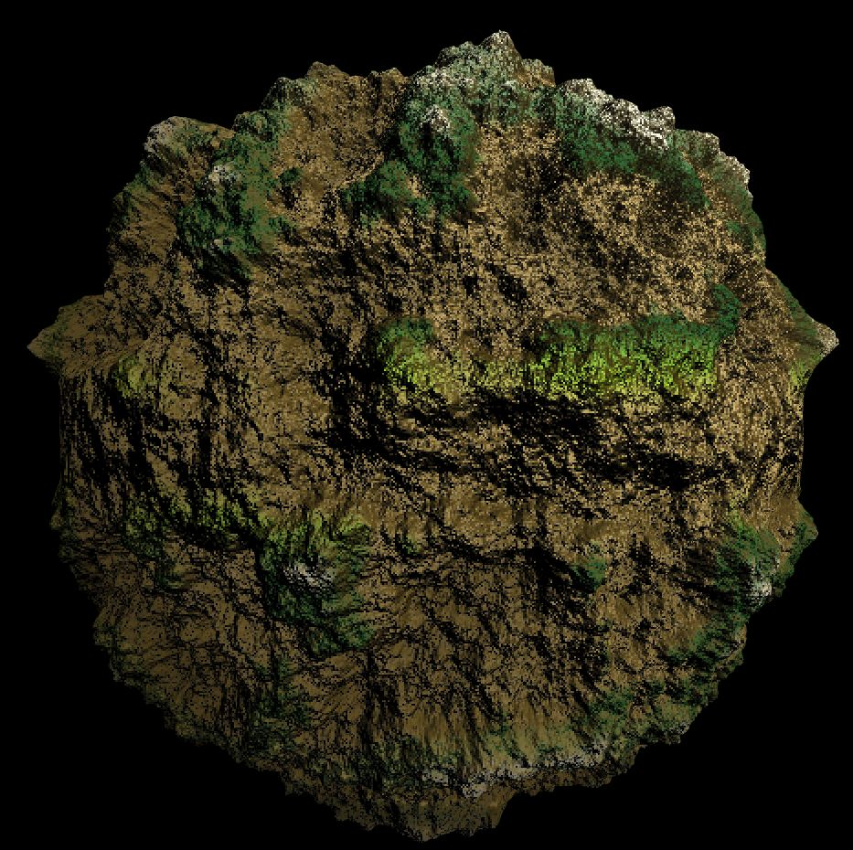

# Noisy Planets

===============
**University of Pennsylvania, CIS 566**

* Jiawei Wang
* Pennkey: jiaww
* Tested on: Windows 10, i7-6700 @ 2.60GHz 16.0GB, GTX 970M 3072MB (Personal)

## Overview
- Use perlin noise functions to procedurally generate the surface of a planet using WebGL
- [Live Demo Link](https://jiaww.github.io/homework-1-noisy-planets-Jiaww/)

| **Final Result** |
|---|
||

## Technique Details
* Basically, I just follow the instructions in [Implicit Procedural Planet Generation](https://static1.squarespace.com/static/58a1bc3c3e00be6bfe6c228c/t/58a4d25146c3c4233fb15cc2/1487196929690/ImplicitProceduralPlanetGeneration-Report.pdf). It's really helpful for the basic idea of the generation of the planet using noise function. 
* I use 3 layers to generate the final planet, they are terrain, ocean and atmosphere. And the color and shininess of different parts of the terrain are decided by their elevations(heights) and the altitude(for polars and tropical region). The followings are the details of my implementations:
  * **Layer 1: Terrain**:
  
  | **Final Result** |
  |---|
  ||

  

## Useful Links
- [Tiny Planet: Earth](https://www.shadertoy.com/view/lt3XDM)
- [Implicit Procedural Planet Generation](https://static1.squarespace.com/static/58a1bc3c3e00be6bfe6c228c/t/58a4d25146c3c4233fb15cc2/1487196929690/ImplicitProceduralPlanetGeneration-Report.pdf)
- [Curl Noise](https://petewerner.blogspot.com/2015/02/intro-to-curl-noise.html)
- [GPU Gems Chapter on Perlin Noise](http://developer.download.nvidia.com/books/HTML/gpugems/gpugems_ch05.html)
- [Worley Noise Implementations](https://thebookofshaders.com/12/)

