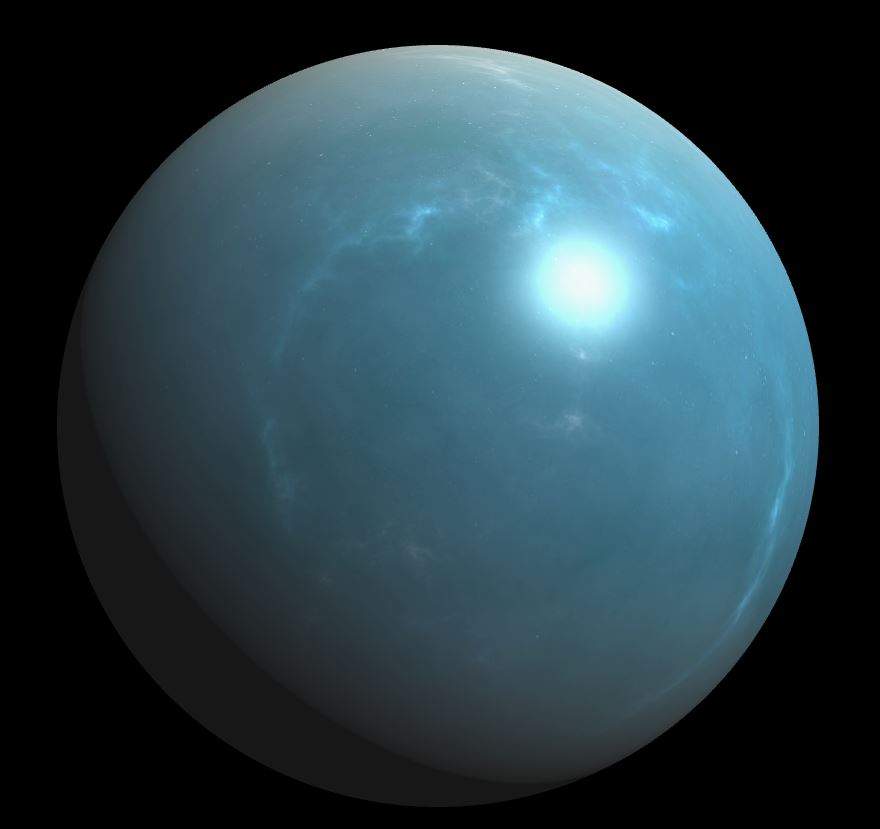
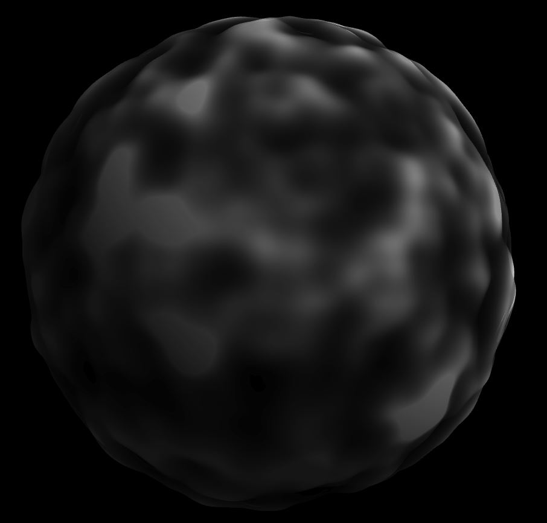

# Noisy Planets

===============
**University of Pennsylvania, CIS 566**

* Jiawei Wang
* Pennkey: jiaww
* Tested on: Windows 10, i7-6700 @ 2.60GHz 16.0GB, GTX 970M 3072MB (Personal)

## Overview
- Use perlin noise functions to procedurally generate the surface of a planet using WebGL
- [Live Demo Link](https://jiaww.github.io/homework-1-noisy-planets-Jiaww/)

| **Final Result** |
|---|
||

## Technique Details

| **Terrain** | **Ocean** | **Atmosphere(Cloud)** |
|---|---|---|
||||

* Basically, I just follow the instructions in [Implicit Procedural Planet Generation](https://static1.squarespace.com/static/58a1bc3c3e00be6bfe6c228c/t/58a4d25146c3c4233fb15cc2/1487196929690/ImplicitProceduralPlanetGeneration-Report.pdf). It's really helpful for the basic idea of the generation of the planet using noise function. 
* I use 3 layers to generate the final planet, they are terrain, ocean and atmosphere. And the color and shininess of different parts of the terrain are decided by their elevations(heights) and the altitude(for polars and tropical region). The followings are the details of my implementations:

  * **Layer 1: Terrain**: 
    * terrain should be the main and most complicated part in this project. For every vertex on the sphere, I push the vertex position from `original_pos` to `original_pos + noise * normalVec`. So different vertices have different elevations(heights), I use these heights and its altitude(`vertexPos.y`) to determine the type of the terrain(Underwater Rock, Coast, Snow, Foliage, Ice, Tropical Foliage), different types have different shininess and color. Also they are not totally seperated, I use interpolation to determine to final `fs_col` in vertex shader, and in fragment shader, for each pixel, it is also an interpolation from `fs_col` passed from vertex shader. You can find more details about the computation rules of the `fs_col` in src/shaders/planet-vert-glsl
  
    * Besides, there is another trick thing. Since the vertex positions are offset in vertex shader using noise, we can no longer use the normals we passed into shader. So we have to recompute the normals to get a accurate lighting results. Here I use following method to compute normals in fragment shader:
     ```glsl
      normalVec = normalize(cross( dFdx(vertexPos.xyz), dFdy(vertexPos.xyz))); 
     ```
     * Also, according to *Implicit Procedural Planet Generation - Report 4.4.2 Level of Detail*, we have to re-offset the vertex according to LOD to reduce the errors, which can be done like following method:
     ```glsl
       int LOD = int(10.0 * (1.0 - smoothstep(0.0, u_Octave, log(length(u_CamPos.xyz)))));
       float noise = fbm(fs_Pos.xyz, resolution, LOD) * 2.0;
       noise = pow(noise,  u_TerrainInfo.x);
       vec4 vertexPos = fs_Pos;
       vertexPos.xyz += localNormal * noise;
     ```
     * After getting the normal, we can use it to decide the final terrain color, which is an interpolation of the `MoutainColor` and `fs_col` according to 'Steepness', then use the final terrain color to compute the lighting result, then get the final color of the pixel.
     * About the `noise` we're using, it's generated by **fractional Brownian motion (fBm)** using a 3D Perlin noise function, which I modify from the code Adam write in class(2D Perlin noise).  
  
  
  

## Useful Links
- [Tiny Planet: Earth](https://www.shadertoy.com/view/lt3XDM)
- [Implicit Procedural Planet Generation](https://static1.squarespace.com/static/58a1bc3c3e00be6bfe6c228c/t/58a4d25146c3c4233fb15cc2/1487196929690/ImplicitProceduralPlanetGeneration-Report.pdf)
- [Curl Noise](https://petewerner.blogspot.com/2015/02/intro-to-curl-noise.html)
- [GPU Gems Chapter on Perlin Noise](http://developer.download.nvidia.com/books/HTML/gpugems/gpugems_ch05.html)
- [Worley Noise Implementations](https://thebookofshaders.com/12/)


